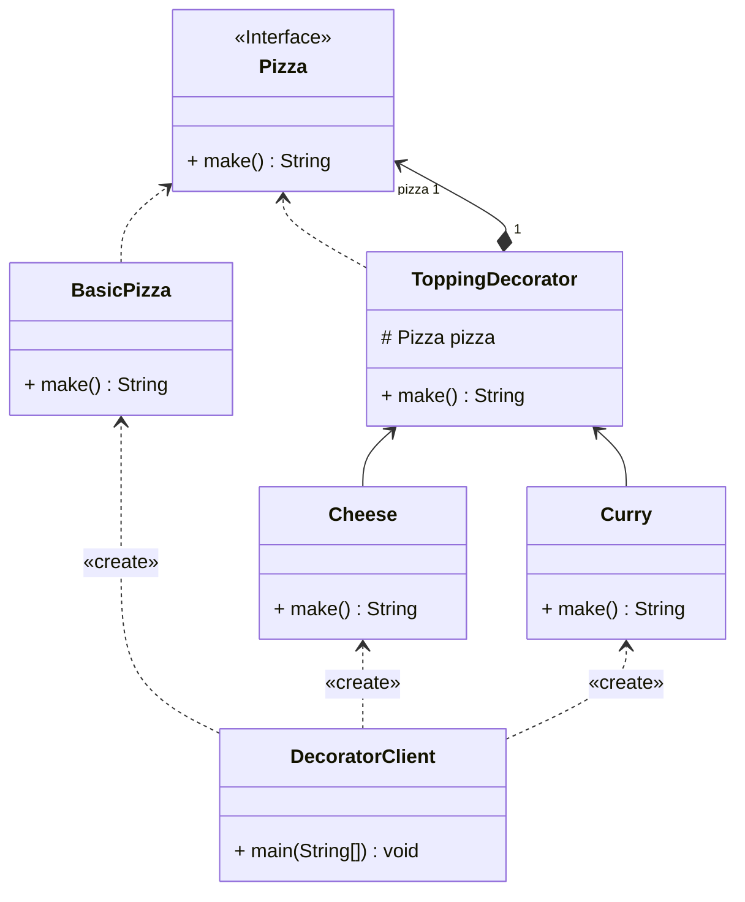
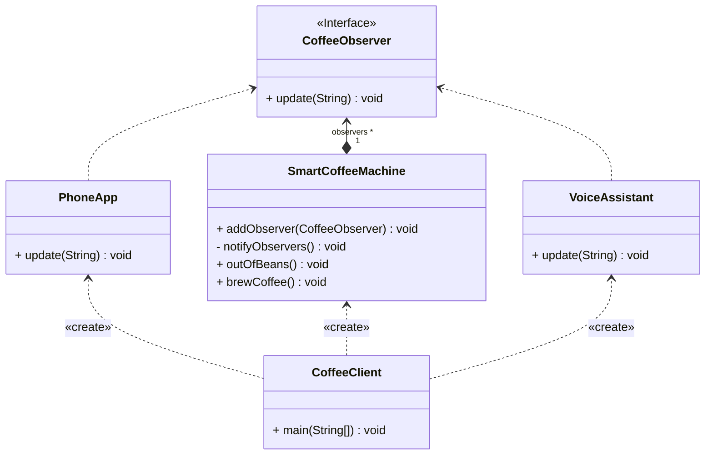

# 设计模式

## 创建型设计模式 creational
### 装配器设计模式 Decorate

---

```mermaid
classDiagram
direction BT
class BasicPizza {
  + make() String
}
class Cheese {
  + make() String
}
class Curry {
  + make() String
}
class DecoratorClient {
  + main(String[]) void
}
class Pizza {
<<Interface>>
  + make() String
}
class ToppingDecorator {
  # Pizza pizza
  + make() String
}

BasicPizza  ..>  Pizza 
Cheese  -->  ToppingDecorator 
Curry  -->  ToppingDecorator 
DecoratorClient  ..>  BasicPizza : «create»
DecoratorClient  ..>  Cheese : «create»
DecoratorClient  ..>  Curry : «create»
ToppingDecorator  ..>  Pizza 
ToppingDecorator "1" *--> "pizza 1" Pizza 

```

---

## 行为型设计模式

### 观察者设计模式 Observer

```mermaid
classDiagram
direction BT
class CoffeeClient {
  + main(String[]) void
}
class CoffeeObserver {
<<Interface>>
  + update(String) void
}
class PhoneApp {
  + update(String) void
}
class SmartCoffeeMachine {
  + addObserver(CoffeeObserver) void
  - notifyObservers() void
  + outOfBeans() void
  + brewCoffee() void
}
class VoiceAssistant {
  + update(String) void
}

CoffeeClient  ..>  PhoneApp : «create»
CoffeeClient  ..>  SmartCoffeeMachine : «create»
CoffeeClient  ..>  VoiceAssistant : «create»
PhoneApp  ..>  CoffeeObserver 
SmartCoffeeMachine "1" *--> "observers *" CoffeeObserver 
VoiceAssistant  ..>  CoffeeObserver 

```

---

